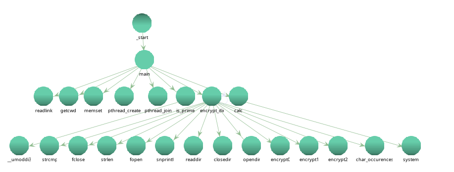
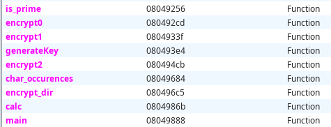
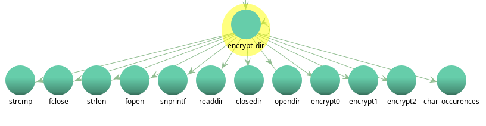

# SLB-2024 – Labo01 – ransTroj

## Auteurs

    - Amir Mouti
    - Ouweis Harun
    - Nathan Rayburn

## First Part

### Manipulation 3.1

On peut déchiffrer en exécutant de nouveau. C'est un simple xor, donc ça réinverse.

### Manipulation 3.2

SEEK_CUR = 1

---

## Second Part: Structure du code

### Manipulation 4.1

### Quesiton 4.1 Que fait le code au debut de main avant l'invocation de la fonction is_prime ? Quel est le but du malware, d'apres vous ?

Le malware lance l'application calculator de gnome afin de faire passer son vrai attaque malicieux en arriere plan sur le main thread. Le thread qui est lancé contient l'application calculator. La synchronisation des threads se fait à la fin de l'attaque du chiffrement du directory.

### Question 4.2 Que fait la fonction is_prime invoquée au döbut du main ? Quel est le but du malware, d'après vous ?

La fonction prime permet de savoir si les deux valeurs entrant sont premier entre les deux param qui sont envoyés dans la fonction.

### Question 4.3 Quelles sont les valeurs passées aux appels à is_prime?

Ce sont deux valeurs qui sont premiers entre eux.

### Question 4.4 : Que fait le code C selon les différentes valeurs de retour de la fonction `is_prime` ?

Si la somme de tout les retours de `is_prime` vaut `4`, en recurision, on descend dans l'arbre et au backtrace, on chiffre les fichiers avec `encrypt0`, `encrypt1` et `encrypt2`. Sinon, on join le thread de la calculatrice `gnome-calculator` et le programme se termine.

### Question 4.5 : Que fait la fonction `encrypt_dir` invoquée après l’appel à `is_prime` dans `main` ?

La fonction `encrypt_dir`, s'occupe de la récurison pour descendre dans l'arbre de système de fichier. Lors du backtrace de la récursion, il compte l'occurence de la lettre `s` dans le nom du directory et ensuite décide quel chiffrement il utilise suivant le résultat. 

s = 1 -> `encrypt0`
s = 2 -> `encrypt1`
s > 2 -> `encrypt2`

### Question 4.6 : Quelles sous-fonctions sont appelées par la fonction `encrypt_dir` et à quelle condition ?

- `strcmp`
- `fclose`
- `strlen`
- `fopen`
- `snprintf`
- `readdir`
- `closedir`
- `opendir`
- `encrypt0`
- `encrypt1`
- `encrypt2`
- `char_occurences`

### Question 4.7 : Quelles exceptions prévoit le code de `encrypt_dir` ? Pourquoi ?

_En attente de réponse et analyse._

### Manipulation 4.2

Dans cette manipulation, nous avons commenté le code C dans Ghidra pour répondre aux questions 4.1 à 4.7. Nous avons renommé et/ou "retypé" les variables locales selon nécessité.

### Question 4.8 : Analysez le code assembleur correspondant à la fonction `encrypt_dir` :

- **Parties de gestion de la pile** : _En attente d'identification._
- **Instructions de chiffrement** : _En attente d'explication._

---
