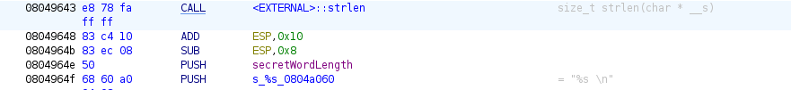
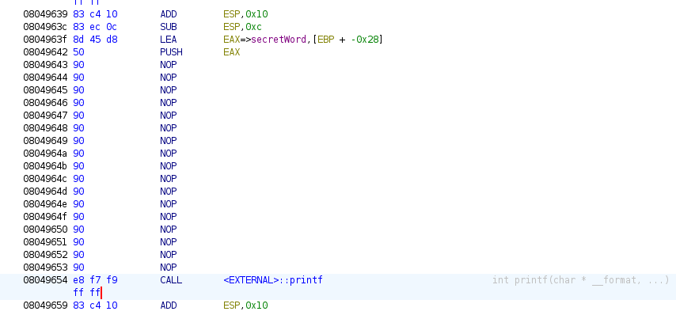
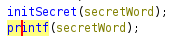

# SLB

## TE1 - Test Blanc - Analyse de code et reverse engineering

### Question 1 : Analyse du code décompilé (10 pts + 2 pts BONUS)

1.1 **Fonctions internes** :  
Identifie toutes les fonctions internes (qui ne proviennent pas d'une librairie externe) présentes dans ton programme. Explique comment tu les trouves et les identifies dans Ghidra. Dessine le graphe des appels de la fonction `main` vers ces fonctions.  
(2 pts)

1.2 **Variables globales** :  
Recense les variables globales utilisées par les fonctions internes listées précédemment. Indique leur valeur initiale si elle est définie en dehors des fonctions.  
(2 pts BONUS)

1.3 **Variables locales dans `main`** :  
Recense les variables locales utilisées dans la fonction `main`. Indique leur type et leur nom donnés par Ghidra. Propose ensuite des noms plus clairs et des types appropriés si nécessaire.  
(2 pts)

1.4 **Étapes du `main`** :  
Le `main` est divisé en plusieurs étapes (par exemple : initialisation, validation des entrées, gestion des scores). Décris en une phrase le traitement des variables dans chacune de ces étapes, en te basant uniquement sur le code décompilé.  
(2 pts)

1.5 **Arguments de `play`** :  
Recense les arguments de la fonction `play` dans ton programme, en indiquant leur type et leur nom d'origine (donnés par Ghidra). Propose des noms plus explicites.  
(1 pt)

1.6 **Traitement des arguments dans `play`** :  
La fonction `play` est découpée en plusieurs étapes. Explique en une phrase le traitement des arguments pour chaque étape, en te basant uniquement sur le code décompilé de `play`.  
(1 pt)

1.7 **Analyse des boucles dans `play`** :  
Analyse en détail les boucles présentes dans la fonction `play`. Que fait la boucle principale et chacune des boucles internes ?  
(2 pts)

---

### Question 2 : Analyse dynamique (15 pts)

2.1 **Mot deviné et score** :  
Quel est le mot deviné qui serait accepté dans le jeu si tu fournissais un dictionnaire spécifique ? Quel serait le score total obtenu si ce mot était trouvé lors du premier tour ?  
(5 pts)

2.2 **Procédure pour découvrir le mot** :  
Explique comment tu as découvert le mot à deviner en décrivant les outils utilisés (GDB, Ghidra, etc.) et les manipulations effectuées.  
(5 pts)

2.3 **Pile d'exécution** :  
Dessine la pile d'exécution après le premier appel à la fonction `play`, juste avant que le joueur entre un nouveau mot. Supposons que la valeur du registre EBP soit 0xfffcfd0 en hexadécimal.  
(5 pts)

---

### Question 3 : Patch (10 pts)

3.1 **Modification pour tricher au score** :  
Modifie une seule instruction assembleur pour que le programme affiche toujours un score de 10, quelle que soit la performance du joueur. Indique :  

1) La fonction concernée  
2) L'instruction originale  
3) L'instruction modifiée  
4) Les conséquences sur le programme  
5) Le résultat visible pour l'utilisateur  
(5 pts)

3.2 **Mot secret fixe** :  
Modifie une seule instruction assembleur pour que le programme utilise un mot secret fixe, peu importe le contenu du dictionnaire. Indique :  

1) La fonction concernée  
2) L'instruction originale  
3) L'instruction modifiée  
4) Les conséquences sur le programme  
5) Le résultat visible pour l'utilisateur  
(5 pts)

Je vais intégrer des questions supplémentaires à partir des éléments des fichiers que tu as fournis pour compléter le test blanc initial que j'ai préparé. Voici les nouvelles questions que je vais ajouter en m'inspirant du style des examens blancs précédents :

### Question 1 : Reverse de binaire (18 pts)

1.1 **Entrées demandées à l’utilisateur** :  
Dans ton programme de jeu, quelles informations sont demandées à l'utilisateur (par exemple, le mot à deviner, le choix d'une option, etc.) ? Identifie les appels qui permettent de demander ces informations.  
(1 pt)

1.2 **Analyse de la pile** :  
Dans la fonction `play`, donne une explication haut niveau expliquant ce que contiennent les adresses [ebp-0x3C] et [ebp-0x28].  
(1 pt)

1.3 **Conditions de transition** :  
Dans la fonction `askChoice`, quelle condition sur les inputs faut-il pour passer à l'étape où le joueur peut deviner un mot ?  
(1 pt)

1.4 **Structure des blocs** :  
A quoi correspond la structure générale des différents blocs qui gèrent les choix de l'utilisateur (jouer, réinitialiser le score, quitter) dans le code décompilé ?  
(1 pt)

1.5 **Analyse du bloc de score** :  
Dans la gestion des scores dans la fonction `play`, donne une explication haut niveau expliquant ce que contient [ebp+local_14] (le score).  
(1 pt)

1.6 **Condition pour terminer le jeu** :  
Quelle condition (en langage haut niveau) faut-il pour que le programme quitte la boucle principale et termine le jeu ?  
(1 pt)

1.7 **Traduction de blocs en C** :  
Écris en C un équivalent du bloc du programme qui traite le score lorsque le joueur fait une bonne ou une mauvaise réponse. Remplace les noms de variables générés automatiquement par Ghidra par des noms plus intelligibles.  
(3 pts)

---

### Question 2 : Reverse de la mémoire (10 pts)

2.1 **Analyse de la mémoire** :  
Au début de la fonction `play`, après le premier tour de jeu, décris ce que contiennent les adresses mémoires pour [ebp-0x3C] et [ebp-0x28]. Utilise des exemples concrets basés sur l'état du jeu pour illustrer tes réponses.  
(5 pts)

2.2 **Commande lancée** :  
En te basant sur l'état de la mémoire après l'appel à la fonction `play`, quelle commande l'utilisateur a-t-il probablement utilisée pour lancer le programme dans cet état ?  
(1 pt)

2.3 **Analyse du code assembleur** :  
Analyse les instructions suivantes dans la fonction `play`, juste après l'appel à `getWord` :

```asm
mov eax, [ebp+local_14]
add eax, 1
mov [ebp+local_14], eax
```

Explique ce que fait chaque ligne de code assembleur en te basant sur la gestion du score dans la fonction.  
(4 pts)

---

Réponses :

### **Question 1 : Analyse du code décompilé**

#### 1.1 **Fonctions internes** (2 pts)

Dans Ghidra, tu peux trouver toutes les fonctions internes (qui ne proviennent pas de bibliothèques externes) en consultant la **"Function window"**. Les fonctions internes sont généralement situées dans le segment de code où se trouve la fonction `main`. Elles apparaissent dans les adresses liées au code du programme.

Pour identifier les fonctions internes :

1. Ouvre Ghidra et charge ton binaire.
2. Clique sur "Functions" dans la fenêtre latérale pour voir la liste de toutes les fonctions.
3. Observe les fonctions situées dans la même section que `main` (elles ne proviennent pas de librairies externes comme `libc`).

Pour le graphe d'appel de `main`, utilise l'outil de graphe de Ghidra en sélectionnant la fonction `main`, puis **clic droit > Show Function Call Graph**. Cela affichera un graphe des appels des fonctions internes à partir de `main`.

---

#### 1.2 **Variables globales** (2 pts BONUS)

Pour identifier les variables globales dans Ghidra :

1. Ouvre l'onglet **"Data"** ou utilise l'onglet **"Symbols"**.
2. Recherche les variables globales en naviguant dans l'espace de données.

Dans ce programme, une variable globale notable est probablement `nodico`, qui est utilisée dans `main` et `initSecret`. `dico` peut également être une variable globale stockant le chemin ou le mot.

Les valeurs initiales des variables globales peuvent être trouvées dans les blocs d'initialisation ou dans les sections `.data` ou `.bss` du binaire.

Tout ce qui est stocké dans `.rodata` est en lecture seule, donc ce ne sont pas des variables globales modifiables.

---

#### 1.3 **Variables locales dans `main`** (2 pts)

Dans Ghidra, tu peux observer les variables locales en ouvrant la fonction `main` et en consultant la partie décompilée à droite. Ghidra donne des noms comme `local_14`, `local_10`, etc. Voici un exemple de proposition de renaming plus clair :

- `local_14` -> `totalScore` : Stocke le score total accumulé.
- `local_10` -> `roundNumber` : Stocke le nombre de tours joués.
- `iVar2` -> `choice` : Stocke le choix fait par l'utilisateur (provenant de `askChoice`).

Les types de ces variables peuvent être inférés par leur utilisation dans les opérations (généralement `int` dans ce cas).

---

#### 1.4 **Étapes du `main`** (2 pts)

Voici une décomposition des étapes de la fonction `main` :

1. **Initialisation des variables** : Le programme initialise les variables locales comme `roundNumber` et `totalScore`.
2. **Vérification des arguments** : Le programme vérifie si le nombre d'arguments est correct. S'il est incorrect, un message d'erreur s'affiche.
3. **Ouverture du dictionnaire** : Si les arguments sont corrects, il tente d'ouvrir le fichier dictionnaire ou de définir un mot via `-s`.
4. **Boucle principale du jeu** : Le programme entre dans une boucle où il demande à l'utilisateur de jouer, de réinitialiser le score ou de quitter.
5. **Fin du programme** : Le programme termine lorsque l'utilisateur choisit de quitter le jeu.

---

#### 1.5 **Arguments de `play`** (1 pt)

Pour identifier les arguments de la fonction `play`, tu peux utiliser Ghidra pour voir la signature de la fonction :

- **Argument 1** : `int roundNumber` - Le numéro du tour. Ce nom peut être proposé pour refléter son rôle dans la gestion des tours du jeu.

---

#### 1.6 **Traitement des arguments dans `play`** (1 pt)

La fonction `play` prend l'argument `roundNumber`. Voici les étapes de traitement des arguments :

1. Le programme initialise un score à 10 et un compteur d'essais à 0.
2. Le mot secret est initialisé avec `initSecret`.
3. À chaque itération, l'utilisateur devine un mot qui est comparé au mot secret.

---

#### 1.7 **Analyse des boucles dans `play`** (2 pts)

La fonction `play` contient une boucle principale `do-while`. Voici une analyse de chaque boucle :

- **Boucle principale** : Incrémente le compteur d'essais à chaque itération. Le jeu continue jusqu'à ce que le joueur atteigne 10 essais ou devine correctement le mot.
- **Boucle interne (`while`) dans `initSecret`** : Cette boucle lit des mots du dictionnaire jusqu'à atteindre l'index aléatoire déterminé par `rand()`.

---

### **Question 2 : Analyse dynamique**

#### 2.1 **Mot deviné et score** (5 pts)

Le mot accepté dépend du dictionnaire chargé. Si tu utilises un dictionnaire spécifique et que tu devines correctement le mot lors du premier tour, le score final sera de 10.

---

#### 2.2 **Procédure pour découvrir le mot** (5 pts)

Pour découvrir le mot, tu peux utiliser GDB et Ghidra. Voici un exemple de procédure :

1. Place un point d'arrêt dans `play` après l'appel à `initSecret`.
2. Examine le contenu de `secretWord` dans GDB :

   ```gdb
   x/s $ebp-0x28  // Lire le buffer contenant le mot secret
   ```

3. Tu peux également utiliser Ghidra pour suivre le flux du programme et identifier où est stocké le mot secret.

---

#### 2.3 **Pile d'exécution** (5 pts)

La pile juste avant que le joueur entre un nouveau mot ressemblerait à ceci :

- Adresse `0xfffcfd0` : Contient la valeur de EBP.
- Adresse `0xfffcfd4` : Retour de la fonction `play`.
- Adresse `0xfffcfd8` : `secretWord` (le mot à deviner).
- Adresse `0xfffcffc` : `playerGuessBuffer` (le mot deviné par le joueur).

---

### **Question 3 : Patch**

#### 3.1 **Modification pour victoire garantie tout court** (5 pts)

1. **Fonction concernée** : `play`
2. **Instruction originale** :

   ```asm
           080496b5 74 1e           JZ         LAB_080496d5

   ```

3. **Instruction modifiée** :

   ```asm
              080496b5 EB 1E           JMP        0X080496ce
   ```

4. **Conséquences** : Peu importe le guess, nous gagnons
5. **Résultat visible** : Le joueur voit un score de 10 après chaque partie, peu importe le mot mis.

#### 3.2 **Mot secret premier du dictionnaire** (5 pts)

1. **Fonction concernée** : `initSecret`
2. **Instruction originale** :

   ```asm
     0804936c 74 0c           JZ         LAB_0804937a
   ```

3. **Instruction modifiée** :

   ```asm
     0804936c 74 0c JMP 0x08049388 
   ```

4. **Conséquences** : On récupère toujours le premier mot du dictionnaire
5. **Résultat visible** : Le joueur doit toujours deviner le même mot.

#### 3.3 **Imprimer le secret** (5 pts)

1. **Fonction concernée** : `play`
2. **Instruction originales** :

nous modifions dans les datas la valeur du printf pour mettre du print %s, et ensuite nous allons push le secret dans eax puis skip toutes les instructions entre le push et le print à l'aide de nop afin d'avoir le secret dans la consigne



1. **Instruction modifiées** :

   
   

2. **Conséquences** : Nous pouvons maintenant voir le secret directement au début du round
3. **Résultat visible** : nous le voyons à l'écran instantanément.

---
---

### **Question 1 : Reverse de binaire (18 pts)**

#### 1.1 **Entrées demandées à l’utilisateur** (1 pt)

Dans ton programme de jeu, les informations suivantes sont demandées à l'utilisateur :

- **Le choix de l'action** (jouer, réinitialiser le score, quitter) : Ceci est géré par la fonction `askChoice` où l'utilisateur doit entrer `1`, `2`, ou `3`.
- **Le mot à deviner** : Lorsqu'un utilisateur choisit de jouer, il est invité à entrer un mot. Cela est capturé par la fonction `getWord`, qui lit l'entrée de l'utilisateur et la stocke dans le buffer `playerGuessBuffer`.

Les appels spécifiques que tu peux observer dans Ghidra :

- `askChoice` utilise `getchar` pour capturer le choix de l'utilisateur.
- `getWord` utilise aussi `scanf` ou `fgets` pour récupérer le mot que l'utilisateur entre.

---

#### 1.2 **Analyse de la pile** (1 pt)

Dans la fonction `play`, les adresses [ebp-0x3C] et [ebp-0x28] contiennent respectivement :

- **[ebp-0x3C]** : `playerGuessBuffer`, qui stocke le mot deviné par le joueur.
- **[ebp-0x28]** : `secretWord`, qui contient le mot secret généré ou défini via `-s`.

Ces adresses représentent des buffers où les mots sont comparés pendant le jeu. Utilise Ghidra pour suivre la gestion de ces buffers dans la fonction `play`.

---

#### 1.3 **Conditions de transition** (1 pt)

Dans la fonction `askChoice`, la condition pour passer à l'étape où le joueur peut deviner un mot est lorsque l'utilisateur entre **1** pour jouer. L'entrée est capturée par `getchar`, et la fonction vérifie si la valeur est `1`, `2`, ou `3`. Si l'utilisateur choisit `1`, le jeu procède à la fonction `play` où il peut deviner un mot.

Cette logique peut être observée dans le flux de la fonction `askChoice`, et tu peux suivre le passage au `switch-case` ou à la condition `if-else` en observant les transitions de valeurs retournées par `getchar`.

---

#### 1.4 **Structure des blocs** (1 pt)

La structure des blocs qui gère les choix de l'utilisateur dans `main` et `askChoice` suit une logique simple de **menu** :

- **Bloc Jouer** : Si l'utilisateur choisit `1`, le programme appelle la fonction `play`.
- **Bloc Réinitialiser** : Si l'utilisateur choisit `2`, le programme réinitialise les scores à 0.
- **Bloc Quitter** : Si l'utilisateur choisit `3`, le programme termine la boucle et affiche un message de fin.

Ces blocs sont organisés sous forme de conditions `if-else` ou un `switch-case` dans le code décompilé. Le gestionnaire de choix repose sur des instructions comme `getchar()` et une série de comparaisons avec les valeurs possibles.

---

#### 1.5 **Analyse du bloc de score** (1 pt)

Dans la gestion des scores dans la fonction `play`, l'adresse [ebp+local_14] contient la variable **score** qui est initialisée à 10. Ce score diminue à chaque tentative ratée, et il est retourné une fois que le joueur devine correctement ou atteint la limite des essais.

---

#### 1.6 **Condition pour terminer le jeu** (1 pt)

La condition pour que le jeu se termine (en langage haut niveau) dans la boucle principale est :

- Si l'utilisateur entre **3** dans `askChoice`, la fonction retourne et le jeu sort de la boucle principale dans `main`.
- Dans la fonction `play`, le jeu termine également si le joueur devine le mot correctement ou après 10 essais.

Cela se traduit par des conditions du type :

```c
if (attempts >= 10 || isMatch == 1) {
    break; // Terminer le jeu
}
```

---

#### 1.7 **Traduction de blocs en C** (3 pts)

Voici une version en C du bloc de code qui gère le score après que le joueur ait deviné un mot, en remplaçant les noms automatiques par des noms plus explicites :

```c
if (wordExists(playerGuess)) {
    if (compareWords(playerGuess, secretWord) == 1) {
        isMatch = 1;  // Le mot correspond
    } else {
        isMatch = 0;  // Le mot ne correspond pas
    }
}

if (!isMatch) {
    score--;  // Réduire le score si le mot ne correspond pas
}

if (attempts >= 10 || isMatch) {
    printf("Le score final est : %d\n", score);
    return score;  // Retourner le score final
}
```

---

### **Question 2 : Reverse de la mémoire (10 pts)**

#### 2.1 **Analyse de la mémoire** (5 pts)

Après le premier tour de jeu dans la fonction `play`, voici ce que contiennent les adresses [ebp-0x3C] et [ebp-0x28] :

- **[ebp-0x3C]** : `playerGuessBuffer` - Contient le mot deviné par le joueur lors du premier tour. Par exemple, si le joueur a entré "apple", cet emplacement contient `"apple"`.
- **[ebp-0x28]** : `secretWord` - Contient le mot secret que le joueur essaie de deviner. Si le mot secret est "orange", cet emplacement contient `"orange"`.

Ces buffers sont utilisés pour comparer les mots et déterminer si le joueur a deviné correctement.

---

#### 2.2 **Commande lancée** (1 pt)

En te basant sur l'état de la mémoire après l'appel à la fonction `play`, si les buffers [ebp-0x3C] et [ebp-0x28] sont remplis avec des mots comme "apple" et "orange", la commande que l'utilisateur a probablement lancée pour lancer le programme dans cet état serait :

```bash
./programme ./dico.txt
```

Ou bien :

```bash
./programme -s "orange"
```

Si le joueur a choisi le mot secret manuellement avec l'option `-s`.

---

#### 2.3 **Analyse du code assembleur** (4 pts)

Voici une analyse ligne par ligne des instructions assembleur dans la fonction `play`, juste après l'appel à `getWord` :

```asm
mov eax, [ebp+local_14]  // Charge la valeur actuelle de 'score' dans le registre eax
add eax, 1               // Incrémente la valeur de 'score' de 1 (ou toute autre valeur pertinente pour le contexte)
mov [ebp+local_14], eax  // Stocke la nouvelle valeur de 'score' dans la pile à l'emplacement [ebp+local_14]
```

Cette séquence assembleur met à jour le score du joueur en fonction des tentatives. Elle lit d'abord la valeur actuelle de `score`, l'incrémente, puis enregistre cette nouvelle valeur dans la pile.

---

### Tableaux des fonctions avec les différents offset des variables

### Différents scénarios d'exercice et réponse

Voici quelques questions typiques qui pourraient apparaître à la fin du rapport, avec des réponses suggérées et les manipulations à effectuer en conséquence :

### Question 1 : Pourquoi avons-nous souvent les mêmes premiers mots du dictionnaire donnés ?

#### Réponse1

Le comportement de la sélection aléatoire du mot dans le dictionnaire repose sur la fonction **`rand()`** pour générer un index aléatoire. Cependant, si la fonction **`srand()`** n'est pas utilisée pour initialiser le générateur de nombres aléatoires avec une graine différente à chaque exécution, le générateur **`rand()`** produit toujours la même séquence de nombres, d'où le fait que les mêmes mots sont souvent sélectionnés en premier.

#### Manipulation1

1. Vérifier si la fonction **`srand(time(NULL))`** est appelée avant l'utilisation de **`rand()`**.
2. Ajouter cette ligne dans la fonction **`main()`** ou dans **`initSecret()`** si elle est absente.
3. Tester la différence avant et après l'ajout de **`srand(time(NULL))`** pour observer si les mots changent plus souvent à chaque exécution.

---

### Question 2 : Comment faire un patch pour prendre toujours le premier mot du dictionnaire et non un mot aléatoire dedans ?

#### Réponse2

Pour modifier la fonction **`initSecret`** afin qu'elle prenne toujours le premier mot du dictionnaire, il suffit de retirer l'utilisation de l'index aléatoire généré par **`rand()`** et de modifier la boucle de lecture pour qu'elle s'arrête après la lecture du premier mot.

#### Manipulation2

1. Dans la fonction **`initSecret`**, commenter ou supprimer cette ligne :

   ```c
   randomIndex = rand();  // Supprimer la génération d'un index aléatoire
   ```

2. Modifier la boucle de lecture pour s'arrêter dès le premier mot lu :

   ```c
   if (local_10 == 1) break;  // Arrêter après la lecture du premier mot
   ```

3. Recompiler et tester pour vérifier que le programme utilise toujours le premier mot du dictionnaire.

---

### Question 3 : Comment vérifier si le dictionnaire contient des mots valides avant de les utiliser ?

#### Réponse3

Il est important de vérifier que le fichier dictionnaire contient des mots valides avant d'essayer de les lire. On peut ajouter une condition après l'ouverture du fichier pour vérifier si le fichier est vide ou si les mots lus sont valides.

#### Manipulation3

1. Ajouter une vérification après l'ouverture du fichier dans la fonction **`initSecret`** :

   ```c
   if (feof(__stream)) {
       printf("Le dictionnaire est vide ou corrompu.\n");
       fclose(__stream);
       return;
   }
   ```

2. Si le fichier est vide ou que **`fscanf()`** ne peut pas lire de mot valide, afficher un message d'erreur et retourner une valeur indiquant l'échec.

---

### Question 4 : Comment augmenter la taille maximale des mots acceptés dans le programme ?

#### Réponse4

Actuellement, le programme utilise un tampon de 20 caractères pour stocker les mots du dictionnaire. Pour accepter des mots plus longs, il suffit d'augmenter la taille de ce tampon.

#### Manipulation4

1. Localiser la ligne suivante dans la fonction **`initSecret()`** :

   ```c
   fscanf(__stream, "%19s", secretWord);  // "%19s" pour 19 caractères + le '\0'
   ```

2. Augmenter la taille du tampon **`secretWord`** :

   ```c
   char secretWord[40];  // Par exemple, pour accepter des mots jusqu'à 39 caractères
   ```

3. Modifier également la limite dans **`fscanf()`** pour correspondre à la nouvelle taille :

   ```c
   fscanf(__stream, "%39s", secretWord);  // "%39s" pour 39 caractères + le '\0'
   ```

---

### Question 5 : Comment corriger une éventuelle vulnérabilité de dépassement de tampon lors de la copie du mot secret avec `strcpy()` ?

#### Réponse5

**`strcpy()`** ne vérifie pas la taille du tampon de destination, ce qui peut entraîner un dépassement de tampon si la taille du mot secret dépasse celle du tampon. Pour corriger cela, **`strncpy()`** peut être utilisé pour limiter la copie du mot à la taille du tampon.

#### Manipulation5

1. Remplacer **`strcpy(secretWord, dico);`** par **`strncpy(secretWord, dico, sizeof(secretWord) - 1);`**.
2. Cette modification assure que le mot est copié dans **`secretWord`** sans dépasser sa taille maximale.

---

### Question 6 : Comment rendre le jeu plus difficile en limitant le nombre d'essais possibles à 5 ?

#### Réponse6

Pour rendre le jeu plus difficile, on peut limiter le nombre d'essais à un maximum de 5. Cela implique de modifier la fonction **`play`** pour vérifier le nombre d'essais effectués et arrêter le jeu une fois que la limite est atteinte.

#### Manipulation6

1. Dans la fonction **`play`**, ajouter une condition pour vérifier le nombre d'essais :

   ```c
   if (attempts >= 5) {
       printf("Nombre maximal d'essais atteint !\n");
       return 0;  // Arrêter le jeu après 5 essais
   }
   ```

2. Tester le jeu pour vérifier que le nombre d'essais est maintenant limité à 5.

---

### Question 7 : Comment corriger l'affichage du score pour qu'il ne soit pas négatif ?

#### Réponse7

Si le score diminue trop et devient négatif, cela peut affecter l'expérience de jeu. On peut limiter le score à un minimum de zéro.

#### Manipulation7

1. Dans la fonction **`play`**, ajouter une condition après la réduction du score :

   ```c
   if (score < 0) score = 0;  // Le score ne peut pas être inférieur à 0
   ```

2. Recompiler et tester pour vérifier que le score reste toujours positif ou égal à 0.

---

Ces questions couvrent des aspects techniques essentiels que tu pourrais rencontrer lors de l'examen. Chaque question est suivie d'une réponse détaillée et d'une manipulation à effectuer pour que tu puisses te préparer aux tests pratiques. Si tu souhaites d'autres questions ou des explications supplémentaires, fais-le moi savoir !
